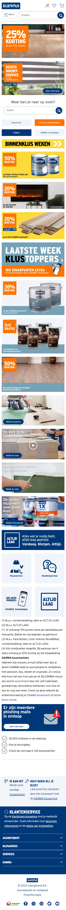
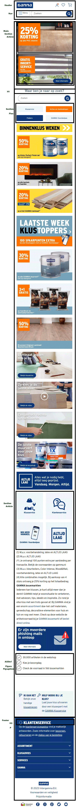
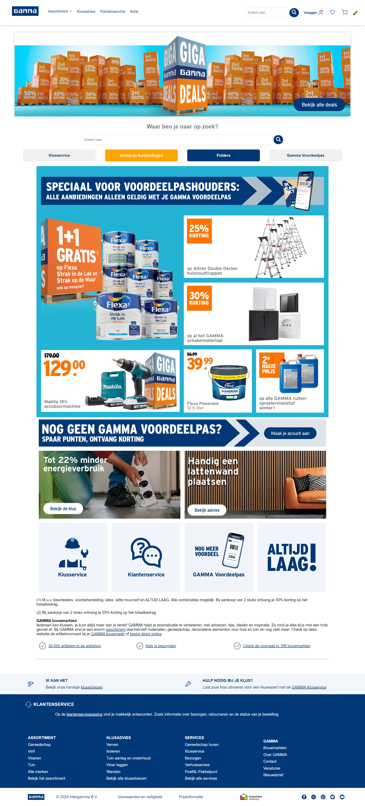
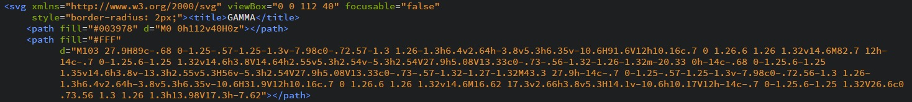
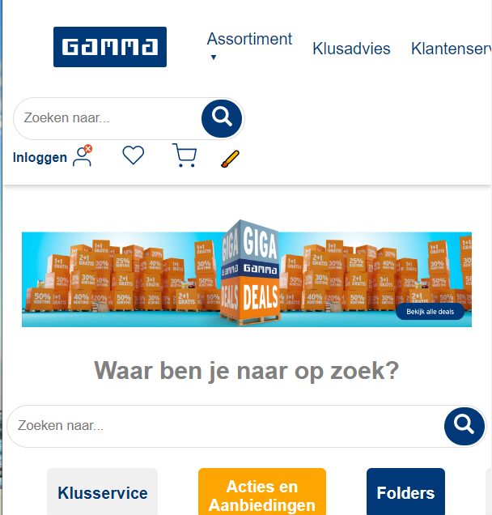

# Procesverslag
Markdown is een simpele manier om HTML te schrijven.  
Markdown cheat cheet: [Hulp bij het schrijven van Markdown](https://github.com/adam-p/markdown-here/wiki/Markdown-Cheatsheet).

Nb. De standaardstructuur en de spartaanse opmaak van de README.md zijn helemaal prima. Het gaat om de inhoud van je procesverslag. Besteedt de tijd voor pracht en praal aan je website.

Nb. Door *open* toe te voegen aan een *details* element kun je deze standaard open zetten. Fijn om dat steeds voor de relevante stuk(ken) te doen.

## Jij

  
uitwerken voor kick-off werkgroep

  ### Auteur:
  Alexander Plet

  #### Je startniveau:
  Blauw

  #### Je focus:
  Responsive
 

## Je website

  
uitwerken voor kick-off werkgroep

  ### Je opdracht:
  
  #### Screenshot(s) van de eerste pagina (small screen): 
  
  

  #### Screenshot(s) van de tweede pagina (small screen):
  
 

## Toegankelijkheidstest 1/2 (week 1)

  
uitwerken na test in de werkgroep

 
  
Niet aanwezig geweest in verband met stage

  ### Bevindingen
  Lijst met je bevindingen die in de test naar voren kwamen:
  - met nette semantische code kan de screenreader alle relevante html elementen voorlezen

  #### Screenreader
  Hier korte omschrijving (met indien nodig afbeeldingen)
  - met nette semantische code kan de screenreader alle relevante html elementen voorlezen
  
  Hier een omschrijving van hoe het opgelost kan worden (met indien nodig afbeeldingen)

  #### Muis en Toetsenbord 
  Hier korte omschrijving (met indien nodig afbeeldingen)
  - met keyboard shortcuts zoals de pijltjes toetsen kan een website makkelijk genavigeert worden als de gebruiker niet met een muis kan werken ivm restricties

  #### Motoriek (shocks, elastiekjes)
  Hier korte omschrijving (met indien nodig afbeeldingen)
  - met keyboard shortcuts zoals de pijltjes toetsen kan een website makkelijk genavigeert worden als de gebruiker niet met een muis kan werken ivm restricties
  
  #### Visueel (brillen, contrast, kleurenblind, dark/light). 
  Hier korte omschrijving (met indien nodig afbeeldingen)
  - met contrast kan er gedacht worden om niet van die velle kleuren te gebruiken sinds iemand met kleurenblindheid bijvoorbeeld het verschil niet zal zien.
  - speel met contrast, dark/light modes
  

## Breakdownschets (week 1)

  
uitwerken na afloop 2e werkgroep

  ### de hele pagina: 

  ### dynamisch deel (bijv menu): 

  ### wellicht nog een dynamisch deel (bijv filter): 

## Voortgang 1 (week 2)

  
uitwerken voor 1e voortgang

  ### Stand van zaken
  hier dit ging goed & dit was lastig (neem ook screenshots op van delen van je website en code)
  Had de breakdown alleen voor voortgang 1.

  ### Agenda voor meeting
  

  ### Verslag van meeting
  hier na afloop snel de uitkomsten van de meeting vastleggen

  - gekeken naar de correcte html tags die horen bij welke gedeelte van de website

## Voortgang 2 (week 3)

  
uitwerken voor 2e voortgang

  ### Stand van zaken
  hier dit ging goed & dit was lastig (neem ook screenshots op van delen van je website en code)
  !
  
  Heb mijn html code compleet van de homepage, alleen nog stylen met css!

  ### Agenda voor meeting

  ### Verslag van meeting
  Tijdens de meeting liet ik zien dat ik de website Gamma heb nagemaakt. Heb alle html content erin zitten, maar het cssen moest nog gebeuren.
  Ik kreeg te horen dat ik goed opweg was. 

## Toegankelijkheidstest 2/2 (week 4)

  
uitwerken na test in 8e werkgroep

  Met microsoft toegankelijkheids tool beetje lopen spelen.

  ### Bevindingen
  Lijst met je bevindingen die in de test naar voren kwamen (geef ook aan wat er verbeterd is):
  
  Voortgang van website was niet geweldig dus niet al te veel nuttige info gehaald uit toegankelijkheidstest
  
  #### Screenreader
  Hier korte omschrijving (met indien nodig afbeeldingen)
  
  screenreader noemt de alt van de images nicely
  
  Hier een omschrijving van hoe het opgelost kan worden (met indien nodig afbeeldingen)

  #### Muis en Toetsenbord 
  Hier korte omschrijving (met indien nodig afbeeldingen)

  Screen reader kon lezen waar ik op klikte

  Hier een omschrijving van hoe het opgelost kan worden (met indien nodig afbeeldingen)

  -

  #### Motoriek (shocks, elastiekjes)
  Hier korte omschrijving (met indien nodig afbeeldingen)

  nvt

  Hier een omschrijving van hoe het opgelost kan worden (met indien nodig afbeeldingen)

  -

  #### Visueel (brillen, contrast, kleurenblind, dark/light). 
  Hier korte omschrijving (met indien nodig afbeeldingen)
  
  site maakt gebruik van blauwe kleuren
  
  Hier een omschrijving van hoe het opgelost kan worden (met indien nodig afbeeldingen)

## Voortgang 3 (week 4)

  
uitwerken voor 3e voortgang

  ### Stand van zaken
  hier dit ging goed & dit was lastig (neem ook screenshots op van delen van je website en code)
  !

  ### Agenda voor meeting

  ### Verslag van meeting
  nth-of-type kan mij helpen met verschillende articles stylen
  Heb een beter beeld wat ik kan doen voor mijn microinteractie

## Eindgesprek (week 5)

  
uitwerken voor eindgesprek

  ### Je uitkomst - karakteristiek screenshots:
  
  was overnieuw begonnen terwijl ik wat hulp kreeg van een ICT'er

  ### Dit ging goed/Heb ik geleerd: 
  Korte omschrijving met plaatjes

  Geleerd beter te werken met flex
  Hoe ik SVGs kan ophalen vanuit de website zelf ipv local afbeeldingen steeds te downloaden.
  

  ### Dit was lastig/Is niet gelukt:
  Korte omschrijving met plaatjes
  
  Responsive ging niet al te geweldig
  nth of type en nth of child moeilijk wanneer te veel genest samen met het geen classes gebruiken heb ik moeten stylen in html ;\
  alle voorbeelden online maken gebruik van classes en divs 
  
  
  

## Bronnenlijst

  
continu bijhouden terwijl je werkt

  Nb. Wees specifiek ('css-tricks' als bron is bijv. niet specifiek genoeg).

1. <a href="https://www.w3schools.com/">w3schools</a>
2. <a href="http://www.onlinewebfonts.com">Online Web Fonts</a>
3. <a href="https://codepen.io/Axiol/pen/QWLRMVr">https://codepen.io/Axiol/pen/QWLRMVr</a>
5. 
6. <a href="https://stackoverflow.com/questions/49934826/how-to-open-sub-menu-with-onclick-function-and-hide-with-onclick-function">https://stackoverflow.com/questions/49934826/how-to-open-sub-menu-with-onclick-function-and-hide-with-onclick-function</a>
7. <a href="https://stackoverflow.com/questions/39892794/toggle-image-in-pure-javascript">https://stackoverflow.com/questions/39892794/toggle-image-in-pure-javascript</a>
8. <a href="https://www.youtube.com/watch?v=emFMHH2Bfvo">SVG uitleg</a>
9. <a href="https://www.youtube.com/watch?v=dMxOojFq2ho">Nth of child en type</a>
10. <a href="https://www.w3schools.com/cssref/css3_pr_flex-wrap.php"> Flex wrap </a>

